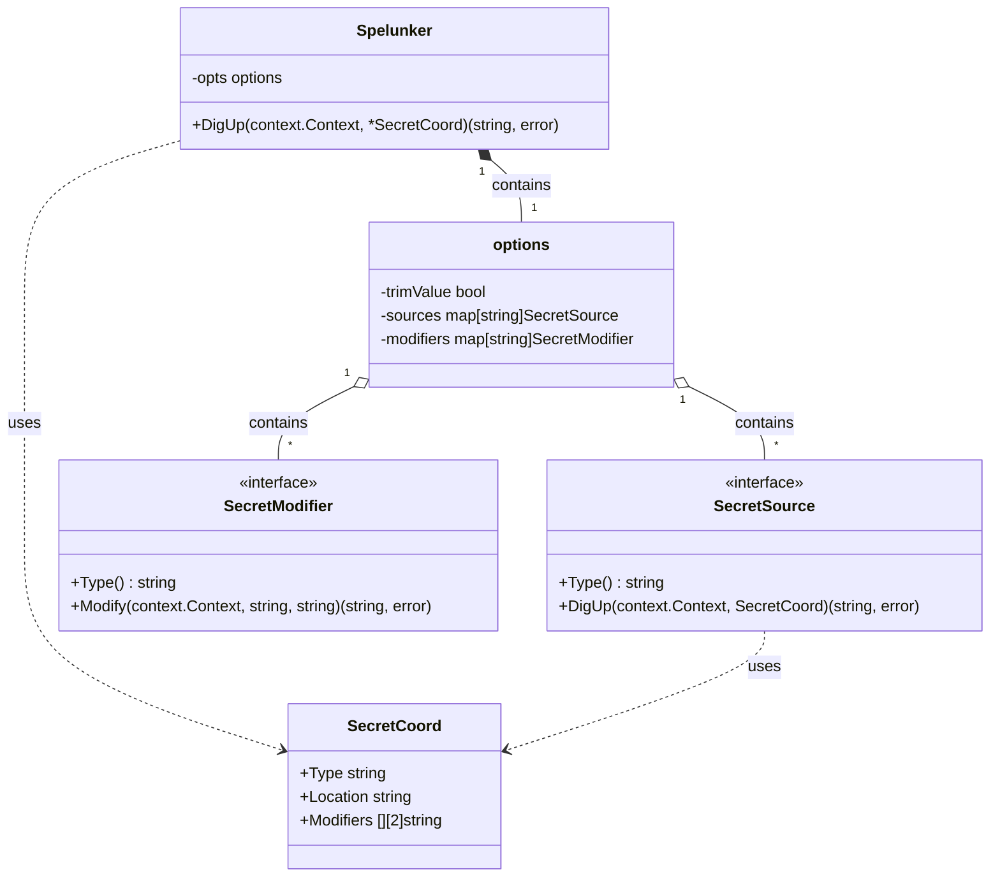
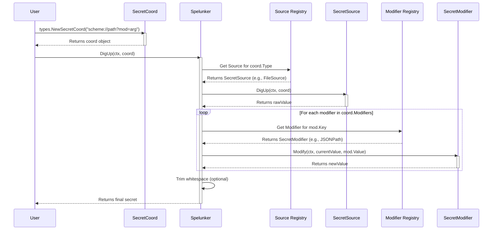

# Architecture

This document describes the high-level architecture of `spelunk`, its core components, and how they interact.

## Overview

`spelunk` is a library designed to abstract the retrieval of secrets from various sources (environment variables, files, Kubernetes secrets, etc.) using a unified URI-based syntax. It allows developers to define *where* a secret is and *how* to process it (e.g., extracting a JSON field) without changing the application logic.

## Core Concepts

The architecture revolves around four main components:

1.  **`Spelunker`**: The main client and entry point.
2.  **`SecretCoord`**: The definition of a secret's location and processing rules.
3.  **`SecretSource`**: An adapter for fetching raw data from a specific backend.
4.  **`SecretModifier`**: A processor for transforming the raw data.

### Class Diagram



## Component Details

### 1. Spelunker (`spelunker.go`)

The `Spelunker` is the coordinator. It maintains a registry of available `SecretSource`s and `SecretModifier`s. When initialized, it can be configured with various options to add custom sources or modifiers.

Its primary method is `DigUp(ctx context.Context, coord *types.SecretCoord) (string, error)`, which orchestrates the retrieval process.

### 2. SecretCoord (`types/coordinates.go`)

`SecretCoord` represents a parsed URI. It is created via `types.NewSecretCoord(uri string)`. It breaks down a string like `file:///config.json?jp=$.database.password` into:

*   **Type**: `file` (determines the Source)
*   **Location**: `/config.json` (passed to the Source)
*   **Modifiers**: `jp=$.database.password` (ordered list of transformations)

### 3. SecretSource (`types/source.go`)

The `SecretSource` interface abstracts the retrieval mechanism. Each implementation handles a specific URI scheme (e.g., `env://`, `file://`, `k8s://`, `vault://`).

*   **Responsibility**: Fetch raw data using the `Location` from `SecretCoord`.
*   **Input**: `SecretCoord`
*   **Output**: Raw string content (e.g., entire file content, env var value).

### 4. SecretModifier (`types/modifier.go`)

The `SecretModifier` interface abstracts data transformation. Modifiers are applied in a chain after the data is fetched.

*   **Responsibility**: Transform a string value based on an argument.
*   **Input**: Current value + Argument (from URI query param).
*   **Output**: Transformed value.

## Execution Flow

The `DigUp` process follows a linear pipeline:

1.  **Parse**: The user parses the input string into a `SecretCoord` (e.g. using `types.NewSecretCoord`).
2.  **Fetch**: The `Spelunker` receives the `SecretCoord`, finds the `SecretSource` matching `SecretCoord.Type`, and calls `DigUp`.
3.  **Transform**: For each modifier in `SecretCoord.Modifiers`, the `Spelunker` finds the matching `SecretModifier` and calls `Modify`.
4.  **Finalize**: The result is optionally trimmed of whitespace (default behavior) and returned.

### Sequence Diagram



## Extensibility

Spelunk is designed to be easily extensible.

### Adding a Source

Implement the `types.SecretSource` interface and register it using `WithSource(source)` option.

```go
type MySource struct{}

func (s *MySource) Type() string { return "myscheme" }
func (s *MySource) DigUp(ctx context.Context, c types.SecretCoord) (string, error) {
    // Implement fetching logic
    return "secret", nil
}

// Usage
s := spelunk.NewSpelunker(spelunk.WithSource(&MySource{}))
```

### Adding a Modifier

Implement the `types.SecretModifier` interface and register it using `WithModifier(modifier)` option.

```go
type MyModifier struct{}

func (m *MyModifier) Type() string { return "upper" }
func (m *MyModifier) Modify(ctx context.Context, val, arg string) (string, error) {
    return strings.ToUpper(val), nil
}

// Usage
s := spelunk.NewSpelunker(spelunk.WithModifier(&MyModifier{}))
// URI: ...?upper=true
```
