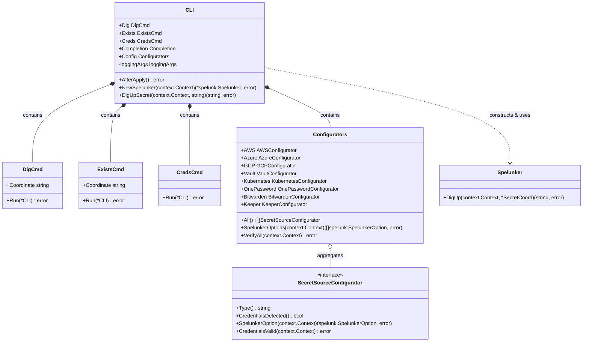
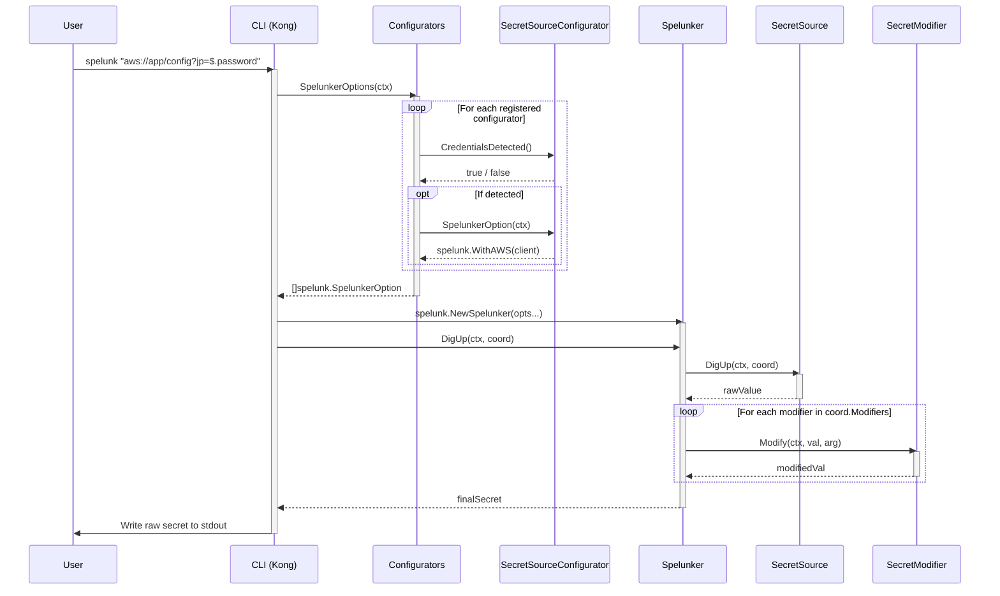

# Spelunk CLI Architecture

This document describes the high-level architecture of the `spelunk` CLI binary (`cmd/spelunk`), its internal components, and how it orchestrates the `spelunk` library.

## Overview

The `spelunk` CLI is an executable wrapper around the `spelunk` core library and its plugin ecosystem. It bundles all official secret sources and modifiers into a single static binary with automated host credential discovery, pipeline-friendly output, and verification utilities.

## Core Concepts

The CLI architecture revolves around five primary components:

1. **`CLI`**: The root command structure parsed by [Kong](https://github.com/alecthomas/kong). Coordinates commands, logging configuration, and engine initialization.
2. **`Commands`**: Subcommand handlers (`DigCmd`, `ExistsCmd`, `CredsCmd`, `Completion`) defining CLI operations.
3. **`SecretSourceConfigurator`**: Interface for detecting, initializing, and validating secret provider clients from CLI flags, environment variables, or host config files.
4. **`Configurators`**: Aggregate container embedding all source configurators and generating `[]spelunk.SpelunkerOption` for the underlying engine.
5. **`Spelunker` Engine**: Core `spelunk.Spelunker` instance wired with active sources and all registered modifier plugins.

### Class Diagram

## Component Details

### 1. Root CLI & Parser (`main.go`, `internal/cli/cli.go`)

`main.go` parses command line arguments and environment variables through Kong.

* **Lifecycle**: `cli.Parse()` builds command hierarchy, registers shell auto-completion, binds configuration, and runs `AfterApply()` to initialize default logging.
* **Dispatch**: Kong calls `Run(*CLI)` on active subcommand.

### 2. Subcommands (`internal/cli/cmd_*.go`)

* **`DigCmd` (`cmd_dig.go`)**: Default command (`default:"withargs"`). Parses coordinates, builds `Spelunker`, retrieves secret, and writes raw string directly to `os.Stdout`.
* **`ExistsCmd` (`cmd_exists.go`)**: Executes secret retrieval without printing value. Returns non-zero exit code if secret coordinate cannot be resolved or accessed.
* **`CredsCmd` (`cmd_creds.go`)**: Iterates through all configurators, identifies detected provider credentials, and performs non-mutating validation calls against remote backends.

### 3. Configurator Pattern (`internal/configurator.go`, `internal/configurator/*`)

Each secret source plugin has a dedicated configurator implementing `SecretSourceConfigurator`:

* **`Type()`**: Returns canonical URI scheme identifier (e.g., `aws`, `k8s`, `vault`).
* **`CredentialsDetected()`**: Checks if configuration is present via CLI flags, environment variables, or standard configuration files (e.g. `~/.aws/credentials`, `~/.kube/config`).
* **`SpelunkerOption(ctx)`**: Instantiates provider client SDK and returns functional option (e.g., `aws.WithAWS(client)`). If credentials are missing, returns `nil` without error.
* **`CredentialsValid(ctx)`**: Performs lightweight, non-mutating API call (e.g., Vault self-token lookup, AWS `ListSecrets` with limit 1, Kubernetes version query) to verify access permissions.

### 4. Logging & Diagnostics (`internal/logger/lib.go`, `internal/cli/args_logging.go`)

Structured logging uses standard `log/slog` with [tint](https://github.com/lmittmann/tint) handler:

* Log output always directs to `os.Stderr`, preserving `os.Stdout` for raw secret values.
* Verbosity managed via counter flags (`-v`, `-vv`, `-q`, `-qq`).
* Formats supported: `tinted` (default colorized console output), `json`, and `boring` (plain text).

### 5. Library Engine Integration

`CLI.NewSpelunker` constructs a `spelunk.Spelunker` instance dynamically:

* Registers all sources where credentials were detected.
* Built-in sources (`plain://`, `file://`, `env://`, `base64://`) and built-in modifiers (`b64`, `b64e`, `b64d`) are enabled automatically by core library.
* Registers all modifier plugins unconditionally: `jsonpath`, `tomlpath`, `xpath`, and `yamlpath`.

## Execution Flow

### Secret Retrieval Flow (`dig`)

1. **Parse Input**: Kong parses command arguments into `CLI` struct and initializes logger.
2. **Coordinate Parsing**: Input string is parsed into `*types.SecretCoord`.
3. **Engine Initialization**: `CLI.NewSpelunker` evaluates all configurators and bundles active source options and modifier options.
4. **Fetch**: `Spelunker.DigUp` identifies target `SecretSource` and fetches raw secret value.
5. **Transform**: `Spelunker` applies modifier chain sequentially (e.g., JSONPath query, Base64 decode).
6. **Output**: Result is written to `os.Stdout` without trailing newlines or log noise.

### Sequence Diagram

## Design Decisions

* **All-in-One CLI Module**: While the Spelunk library uses decoupled Go submodules to keep dependencies minimal for library consumers, the CLI submodule (`cmd/spelunk`) explicitly depends on all plugin modules to produce a batteries-included binary.
* **Auto-Discovery over Explicit Flags**: Users do not need to specify `--source=aws` or `--source=vault`. The CLI detects environment context and resolves appropriate sources dynamically based on coordinates.
* **Pipeline Purity**: Secret values are output verbatim to `stdout`. Diagnostics, logs, and errors write exclusively to `stderr` to ensure compatibility with Unix pipelines and command substitution.
